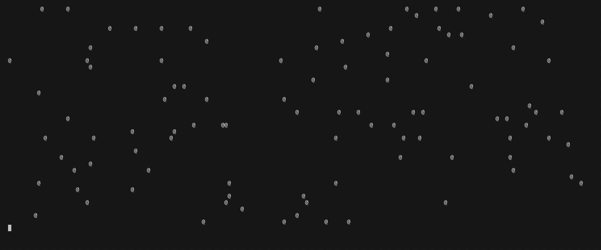
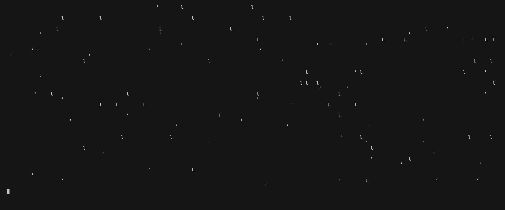
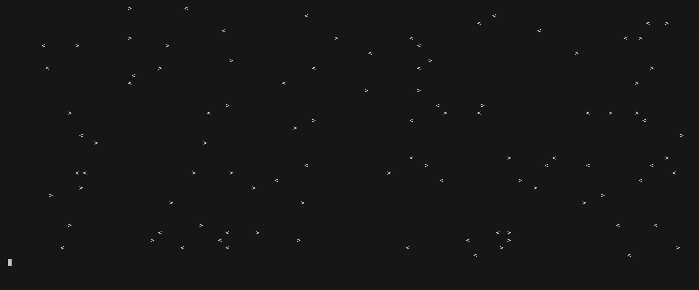
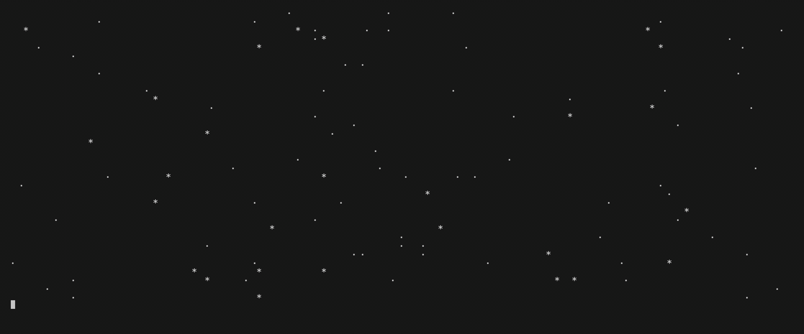

# particlez

A toy particle system written in Rust with `crossterm`, maybe useful for TUI applications.

## Examples

#### Fall to Floor

```
cargo run --example fall_to_floor
```



#### Rainfall

```
cargo run --example rainfall
```



#### Bugs Crawl

```
cargo run --example bugs_crawl
```



#### Spaceflight

```
cargo run --example spaceflight
```



## Changelog

| Date       | Version | Description                          |
| ---------- | ------- | ------------------------------------ |
| 2024-07-08 | 0.0.1   | Supports minimal animation examples. |
